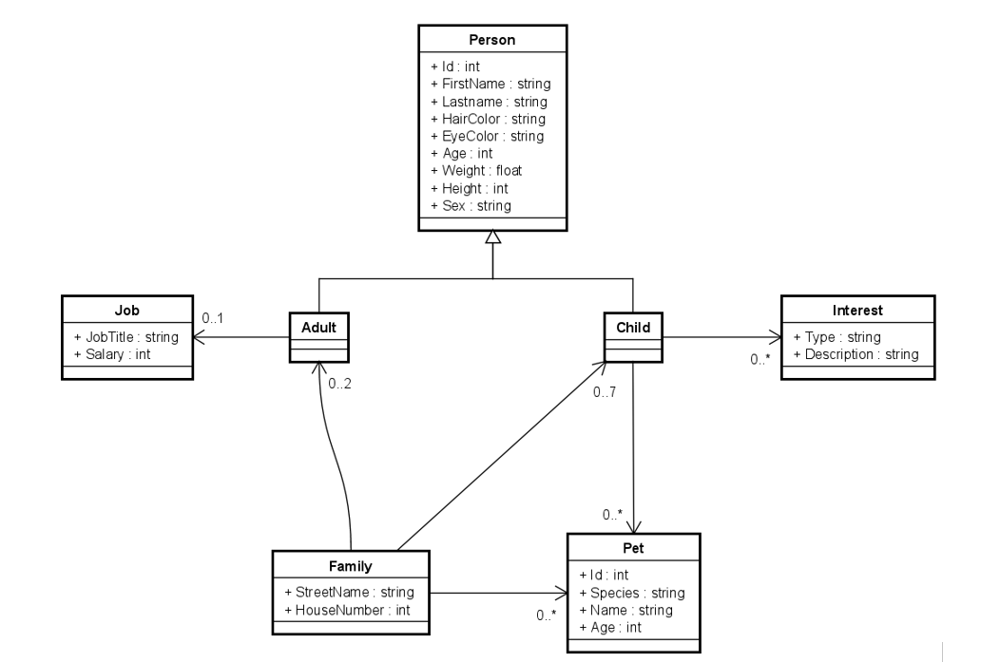
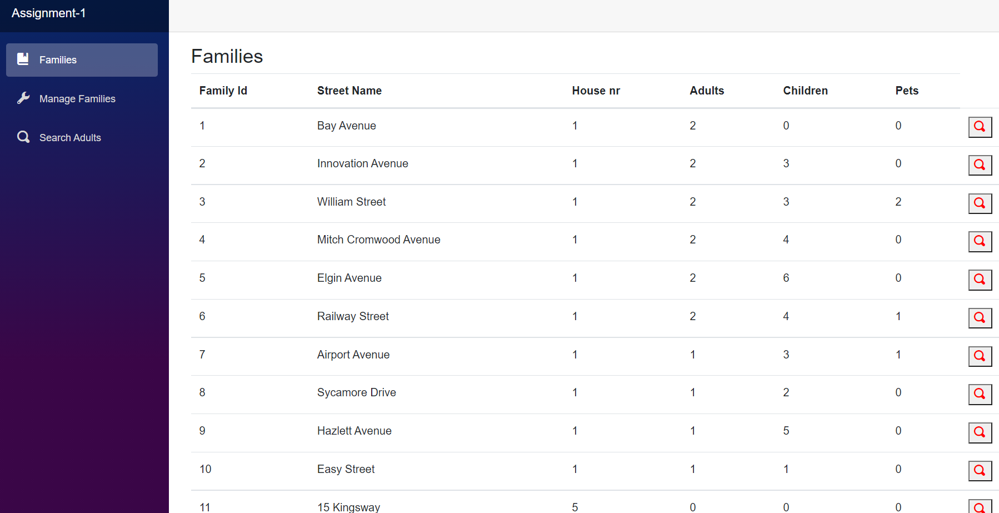
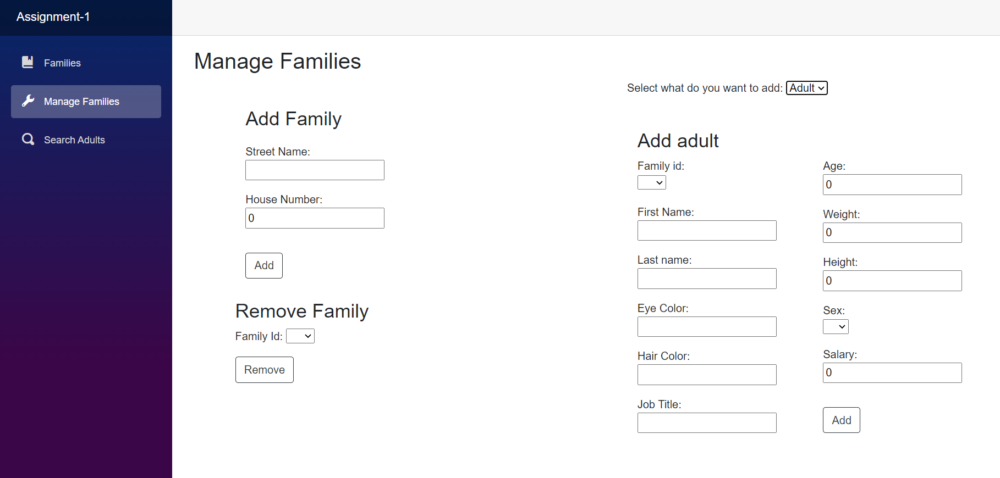
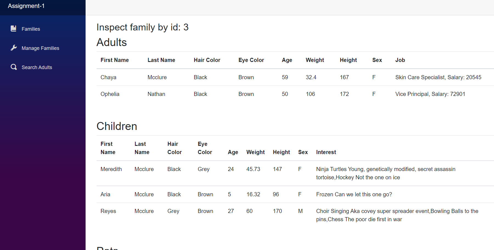

# DNP1Y_Assignment_1

## The system:
In this assignment you will create a Blazor-server web page to manage data and view statistics about families.
The adults have jobs. The children have interests, and pets.

## Minimum requirements:
- Be able to add a new Adult to persistent storage (i.e. the file, through the FileContext class).
- Be able to search for Adults(s) by name or other criteria. The result must be displayed on a web page.
- There must be multiple pages, i.e. one for adding, one for viewing.
- There must be some kind of log in system, which will restrict access to certain parts of the web page, e.g. only logged in users may add Persons. 
- You can create your own User class, and store in a file similarly to the Adults and Families. 
- You may hardcode a couple of users, if needed. Or create a registration page.
- Remember relevant interface separations, like you were taught last semester. This will help you in the following assignments.

## Diagram

## Result

